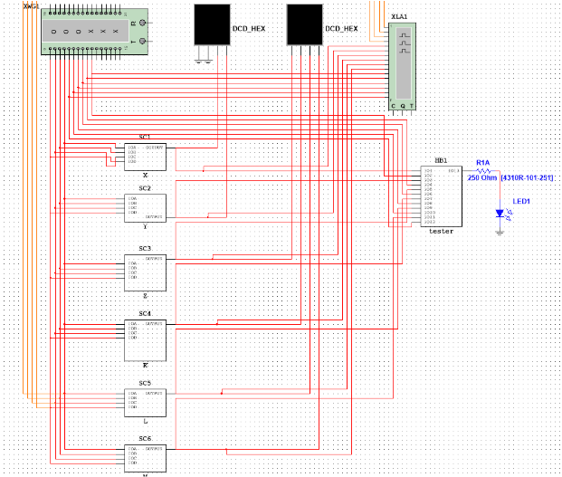
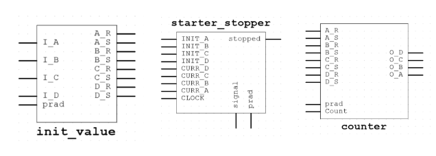
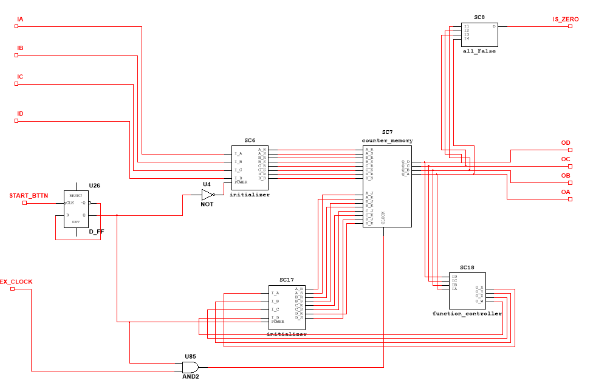
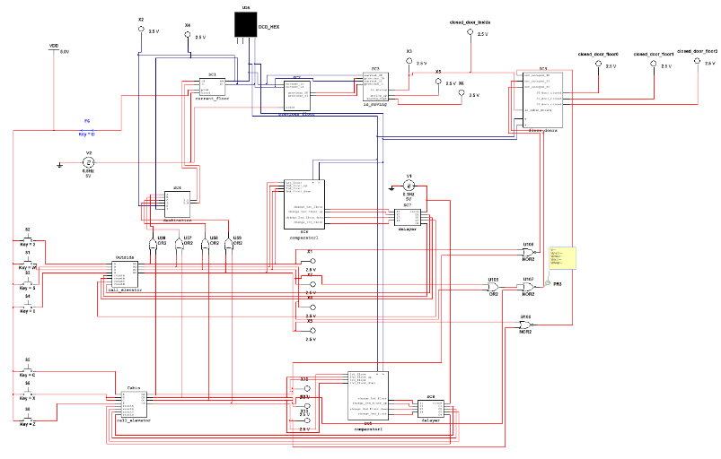

# Digital Techniques

The exercises aim to familiarize with digital/electronic circuits. 💡🔌💻

For exercises 2 and 3, we used our implementation of the McCluskey method. 📚🔬
[Link](https://github.com/barszu/python-lab/tree/main/lab2_McCluskey_api/src)

Team:

- Bartłomiej Szubiak 👨‍💻
- Szymon Kubiczek 👨‍💻
- Tomasz Kurcoń 👨‍💻
- Artur Bogacki 👨‍💻

## Exercise 1: Four-bit natural number to six-bit prime number transcoder

- Objective: Transcode a four-bit natural number to a six-bit prime number. 🔄🔢
- Gates used: NAND. ⚙️
- Transforming numbers from 0 to 15 into prime numbers. 🔢✨
- Carnaught tables. 📊

[Full documentation here](https://docs.google.com/document/d/1LDQ2gGEq8u2YqQ3Kbs4JfQZzdNg7zJ_VLy5GO9NO77E/edit?usp=sharing)

Complete circuit with testing circuit:

## Exercise 2: TIMER ⏰

- Objective: Design a four-bit TIMER circuit. ⏲️
- Setting the time using switches. ⏱️
- Flip-flops and logic gates used. ⚙️
- Counting down from the set time when the START button is pressed. 🔢⏳
- Visual alarm with an LED after the counter reaches zero. 🔴💡
- Displaying the current time on seven-segment displays. 🕒🔢
- Decimal 2\*7 segment displayer. 🔢🔢
- Synchronous and asynchronous solutions. 🔄🔁

[Full documentation here](https://docs.google.com/document/d/17pkMox5OAMT2tjAMu2hGF31NwuVqIPNF-aCqGCLDt9Y/edit?usp=sharing)

Asynchronous solution:

Synchronous solution:

## Exercise 3: ELEVATOR 🏢🔼🔽

- Task: Controlling an elevator in a three-story building. 🚪🔼🔽
- Elevator equipment: motion indicator, direction indicator, door opening sensors, call buttons, floor selection buttons inside the cabin. 🚶🔍🔘
- Updating the current floor indicator. 🔢🏢
- Clarifying and describing ambiguities in the task description. ❓❗
- Querying tasks. ❓❓

[Full documentation here](https://docs.google.com/document/d/150RxAw0c_0qQBlOP-e2WVZaQyt0IptKNoSzSOoNvroo/edit?usp=sharing)

Complete circuit:

